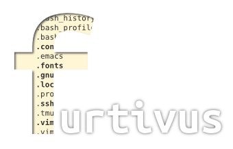

    **Furtivus**:

    *From the Latin, furtivus, meaning secret, hidden.*

furtivus
========

There's a lot of ways to manage your dotfiles in your computer. Let's get a
common and safe one: you make your git dotfiles repository based on a folder
where you move the current dotfiles in a "visible" state and make a symbolic
link to the "default" dotfiles, you clone it into GitHub and you have a remote
copy that you can bootstrap in another computer. But, What happen when you
clone this repository in a computer that have already a dotfiles folder or
another dotfiles repository? An even worse, what happens when this computer has
already symlinks pointing to the dotfiles?

Furtivus will try to solve those situations. The main idea behind this
approach is don't mess with your current dotfiles if you don't want and manage
your dotfiles easy and properly.

